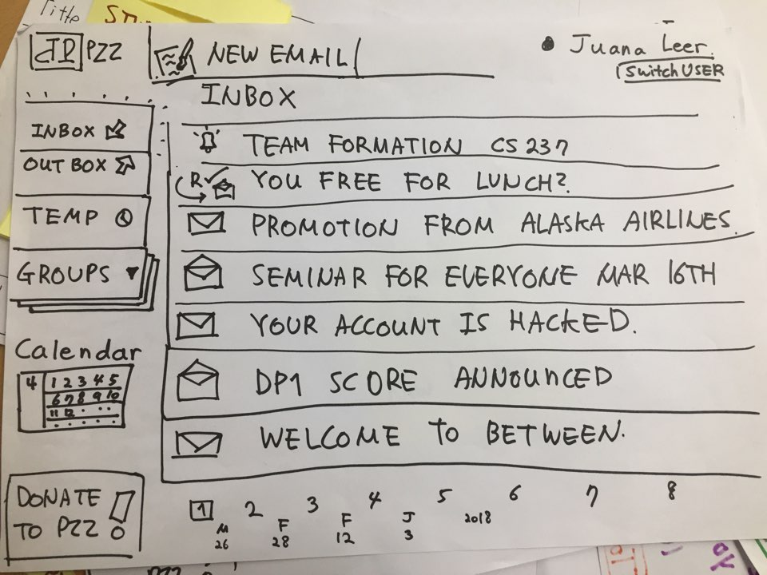
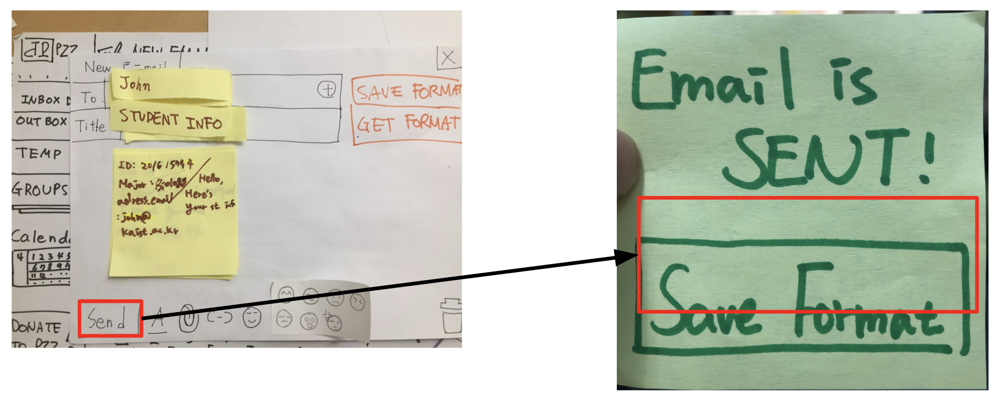
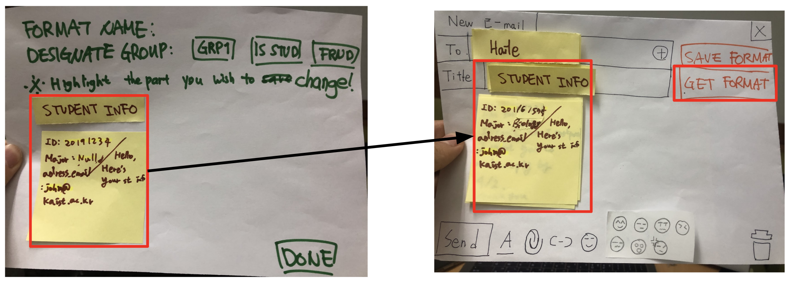
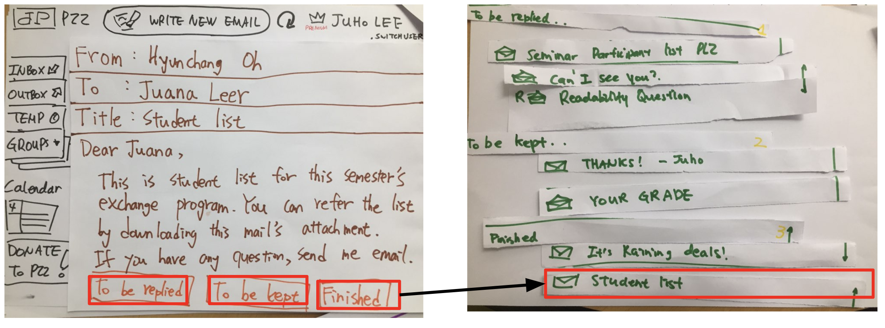
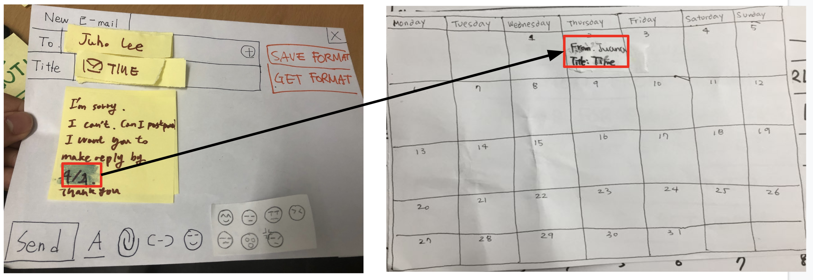

  
**Team. PoZangZee**  
Jeongeon Park, Changhyeon Park, Juan Lee, Hyunchang Oh  
2019 Spring, CS374 Introduction to HCI

# DP3. Paper Prototyping

## Briefing
  
Dear User,  
The following is the main page of an **anonymous email platform**.  
You are going to be Juana Leer, a 34-year-old **administrative officer** who sends many, many emails to professors, students, and other people. To help Juana in her works in sending and keeping track of emails, we developed several new features to **increase efficiency and decrease the likeliness to make mistakes**. Enjoy!  
Best Regards,  
PoZangZee  
> - Our anonymous system was designed to resemble the common Email UI.
> - We provided the background information to the users, using the persona we created, as well as the purpose of the project.
> - We also explained that the computer can be slow, and any type of mouse movements are possible including clicks, drag and drop.

## Tasks
* Task 1
> You have to **send different information to a list of people** on the given list.  
> Use the format saving & format using system to send emails.
* Task 2
> There are seven unread emails in your inbox.  
> You have to **read and label each of them** with the labels given on the bottom.  
> Click the group button to see how the emails are sorted.  
* Task 3
> You have to **reschedule an appointment** you made with the professor.  
> Send an email including the reply due date.  
> After the professor checks the email, check out both people’s calendar.  

## Prototype

### Task 1: Email Auto-formating
  
When the user clicks the *Send* button after writing the email, the *Save Format* button appears
  
By highlighting the part the user wanted to change, the user can create formats easily, and also can use them whenever he/she writes new emails.  
The part will be auto-selected on the email format, so that user may easily change the email contents.

### Task 2: Email Labeling & Grouping
  
Just after reading the email, user can classify the email regarding its states. The states might include *To be replied*, *To be kept*, or *Finished*. Those classified emails are viewed at once, and user can easily change their state by drag & drop.

### Task 3: Auto reply due date detector & uploading on calendar
  
When user write an email, the dates are automatically detected. So, when the recipient read the mail, the dates are automatically added to both users' calender so that users can easily manage their replies.

## Participants

### KAIST Times reporter
> KAIST Undergrad, 22, SoC and Biology, born in S.Korea

Requests interviews and materials for newspaper via emails
* Q1. How often do you send email? 
  * 10 times per a week 
* Q2. Do you have formats?
  * Saves previously sent email to MS document, use them as a format for next email.
* Q3. How do you manage your recipients into groups?
  * Does not use grouping

### ICISTS International Conference Head of PR
> KAIST Undergrad, 21, CBE, born in S.Korea

Contact with other college students, organizations, and administrative office.
* Q1. How often do you send email?
  * 10 per a week
* Q2. Do you have format?
  * Yes. For business purpose, I use a few format that i made with my teammates.
* Q3. How do you manage your recipient into group?
  * I don’t make groups

### KAIST Herald reporter
> KAIST Undergrad, 22, SoC and AE, born in S.Korea

Asks for Interviews and materials for newspaper, receives and replies to voices of the people
* Q1. How often do you send email? 
  * avg 2~3 per a day. Up to 10 mails per a day.
* Q2. Do you have formats?
  * No. Choose proper phrase among several things in mind.
* Q3. How do you manage your recipients into groups?
  * Manages address books for groups of 30~40

## Observation
> **How we classified the problems**: Those issues that critically hamper the successful execution of the key functionality that we opt to provide via the service have been classified as highly critical and feedback that regards such an issue has been given high criticality.  
> **How we will plan to address each problems**: The primary rule and reason that underlies all of the decisions regarding distribution and allocation of resources including, but not limited to, our time and effort and determining the priority, through which the order of implementation of features will be set in cases of contradicting demands from the users, is the order of criticality.

### Theme A: affordance.
* Task 1 (The **Formatting** Feature)
  * **High**: P2 coudn’t find ‘New email button’
  * **Mid**: P2 had difficulty choosing the group name. 
  * **High**: P1 had difficulty finding the ‘close’ button. 
  * **High**: P2: “highlight the parts that is saved, or will be changed?”
* Task 2 (The **Categorizing** Feature)
  * **High**: P2 ‘Group’ may not be a good name for the feature
  * **Mid**: P3 asked if the mail gets deleted if it is sent to the ‘Finished’ group.
  * **High**: All was very familiar with the Drag&Drop, even without explanation
* Task 3 (The **Calendar** Feature)
  * **Mid**: P2 got confused of on which criteria the dates were selected as due dates.

> **plan for Theme A**: Affordance was the most critical theme that arose during the user study. We will try to make the overall UI (the main page) more learnable, as well as coming up with better names for the functions/labels we wish to create.

### Theme B: Customization + More Suggestions
* Task 1 (The **Formatting** Feature)
  * **Low**: P3 tried to send the email to multiple recipients, by stacking their names.
  * **High**: P1 & P3 asked for the formatting feature to be coordinated with MS excel or similar.
  * **Low**: P1 tried to convert the viewport to another by using “Alt+Tab”
* Task 2 (The **Categorizing** Feature)
  * **Mid**: P3 tried to categorize the emails just by looking at the titles, before opening them.
* Task 3 (The **Calendar** Feature)
  * **Mid**: P3 wished to change the calendar design (changed the colour of the tags, post things other than those from emails, etc.)

> **plan for Theme B**: We realized that the each user organizes his/her inbox very differently. We wish to create some kind of customization such as using excel with the email and calendar with colors to meet with more users’ need as possible.

### Theme C: Instant feedback of the computer.
* Task 1 (The Formatting Feature)
  * **Mid**: P2 got confused when the email was sent, but there was no feedback.
* Task 2 (The Categorizing Feature)
  * N/A
* Task 3 (The Calendar Feature) 
  * **Mid**: P3 wished to know if the mail posted on the calendar was replied.
  * **Mid**: P2 wished to know when the mail has been updated on the calendar, before visiting it.

> **plan for Theme C**: Our paper prototype had so many  tasks and different functions so that the user was confused on what to do during the testing. If instant feedbacks, such as alert or change of the read/unread state was included, the users will be on track with the task. We wish to include very understandable feedbacks after each task.

# Feedback of DP3. Paper Prototyping
Overall Reflection: We were very pleased to get many *liked* feedback, and we will do our best for our potential-future target users =)  
We got some interesting *what if* suggestions which worth discussing. These feedback can be critical in some cases, so we decided to talk more about this. Also, some people said we need more detailed explanation, and we promise we will do better! Thank you!

## Individual Reflection

### Jeongeon Park
* What role did you play in each round?
  * I played the **facilitator** role throughout the three user testings.
* What were some of the difficulties you faced playing the role(s)?
  * Although we had the briefs given for consistency, it was still kind of hard to keep my words throughout the testing consistent.
  * My role was to inform the user about the task but not telling them step by step on what to do (for example, telling the users to click on the close button). It was sometimes difficult when I saw the users struggling with the task but could not tell them what to do since that was the whole point of the observation.

### Changhyeon Park
* What role did you play in each round?
  * I played **computer** role of all interviews. 
* What were some of the difficulties you faced playing the role(s)?
  * Our prototypes had many pieces of papers, so I had difficulty to observe the user’s behavior and conduct the operations. There were quite lots of pieces of papers, it’s tough to find proper one for user behavior. We just cut all elements separately and it was the problem. 
  * We made pop-up dialog for unprepared functionality, but I was confused whether the functionality that user chose is implemented in our prototype. For example, if the user clicks the reply issue on the calender, our UI should show the email directly, but we didn’t make platform for containing the email that users wrote. 
  * I always placed in opposite of my users, I think it was a mistake because it made me difficult to observe what user operated.

### Juan Lee
* What role did you play in each round?
  * I was an **observer**, observing user and writing down the user's feedback, interesting moment or behavior, and insights during the user study. I mainly focused on the reaction of users to our interface, for example, frowing face when they can't understand, muttering something related to their task(e.g. *is this same group as before?*), or the order of interface uses.
* What were some of the difficulties you faced playing the role(s)?
  * Since I was observer and sitting next to the user I think I could see many reactions of users. However, I could not ask what I wondered at the moment since I must be silent during the user study. The most difficult moment I've faced is when only I recognized some irregular reaction of user during observing, since I can't ask it even if I saw it.

### Hyunchang Oh  
* What role did you play in each round?
  * In the zeroth interview in class I played the role of **facilitator**, but in all other I played the role of **facilitator-computer**. We had many tasks and many operations along with them, so it was difficult for a single person to hold all object and operate them efficiently. The solution our team came up with was to divide the roles. 
* What were some of the difficulties you faced playing the role(s)?
  * The email service had lots of operations we either couldn't imagine or didn't consider as core features and thus excluded in the paper prototype. The users still bumped to these issues and we had to explain what they were supposed to do and what they were not. This not only made it difficult for facilitotors to provide the right guidance, but also for the users as it restricted the users' freedom and limited the range of feedback we could be getting otherwise. 

## Feedback from Studio
**People liked …**
* Explain about briefing part using e-mail form.
* that you explain all possible actions to users.
* how you explain your task is very clear and complex enough for users
* how you made it look like the popular emailing services, +1 for learnability 
* you provide a good background information for user.
* you include emojis in mail editor XD
* nice service of the grouping feature
* nice categorizing by theme
> Thank you for your kind I-like feedback!  
> We will do our best for the time when you become heavy email user.

**People wished ...**
* can it be served for users who send mails for one-many receivers?
> Yes it can! The entire system is designed for one-many receivers. If you don't mind, can you elaborate your question at the next studio? We want to listen more about this!
* you could explain more about the “categorization by name just by looking”, do you mean filtering by name like in other mailing services?
> Sometimes, we may know or guess the contents of email, especially for the case the mail is coming from important person or the title contains meaningless keyword. This is what meant for *categorization by name just by looking*.  
> One of our user suggested this issue and we thought this is important for efficiency, so we introduced it!
* I like the details on your observations, but it would be great if you could also mention about how you would address them, or the possible reason behind them.
> Thank you for telling us this important issue, and we solved it! We wrote the reason why we divided the *high*, *mid*, and *low* on the top of the observation. Thank you!

**What if ...**
* What if ask to user about importance of the schedule in the email before adding into the calendar? It can be quite annoying to user if all schedules containing date info add into the calendar automatically. 
> This is very interesting issue and also dilemma for us. This may be necessary for safety issue but may lower the efficiency. We've thought about *add first - notify - provide undo* as we learned in the class. Thank you for reminding this important issue for us, we will talk more about this.
* you use tagging (like Dr. Papper do) for the recipient groups
> I like your idea! Unlike to the existing mailbox interface, this may help users more easily handle their emails. Just like to our categorizing solution, we will talk more about your idea. Thank you!

**And others**
* if there are a lot dates in email than what happen?
> In current step of prototype, all the dates will be added on the calendar. We agreed that this can make some issue since many same texts are viewed on the calendar(may be inefficient to browse schedule). Of course, user must be able to customize his/her own calendar, but we need to talk more about this. Thank you!