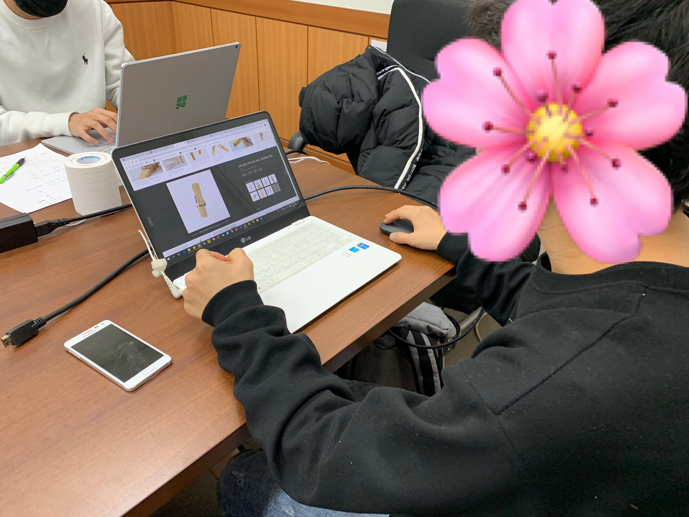
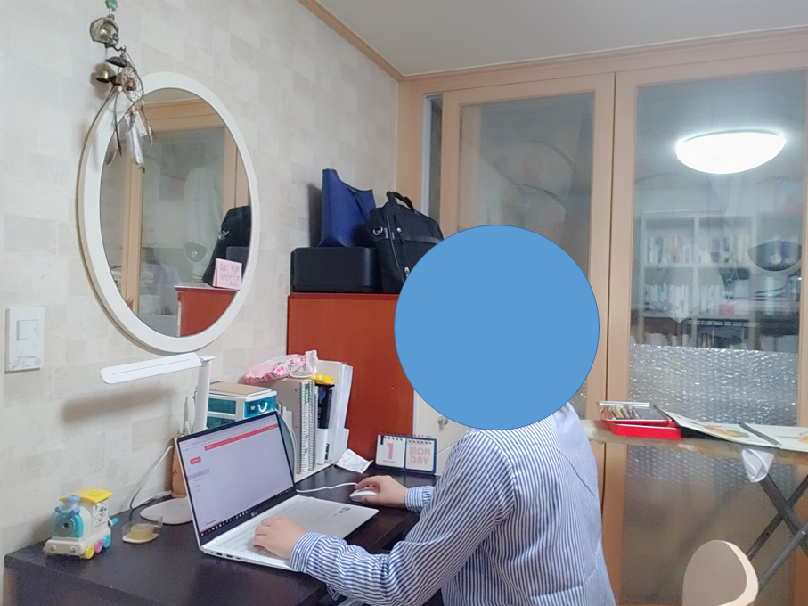
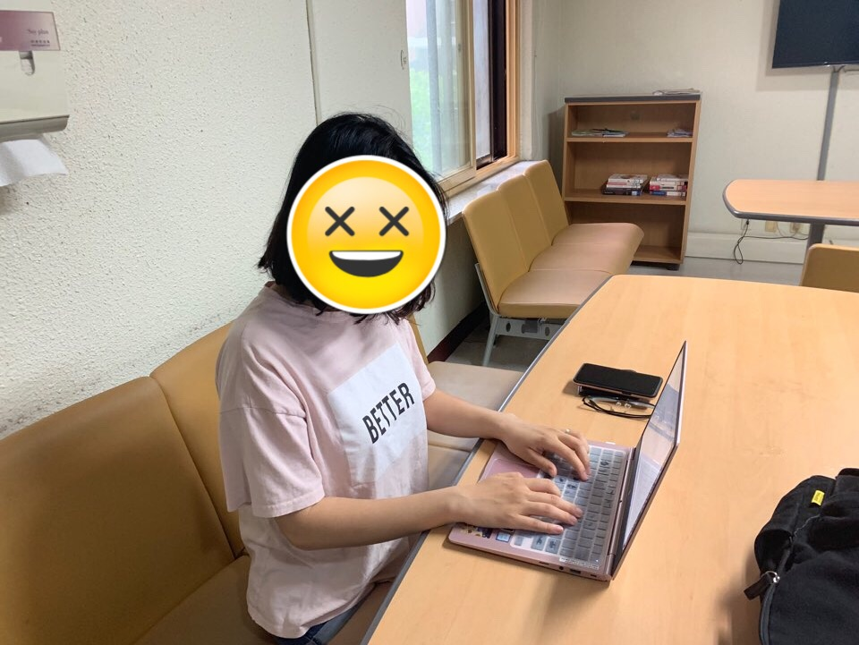

# DP7. User Testing

---

## Written protocol

### **1. Instructions for preparation and setting up the testing environment**

Before you run the experiment, you need to read this document carefully. This is an instruction for the testers, which includes the testing environment, sample data, and testing methods.

1. Testing Environment

*Pozangzee.com* is developed and tested on **Chrome 74.0**, so the only thing you need to prepare is to install **Chrome >= 74.0**. However, because of the screen resolution, we recommend you to use a screen big enough to display Pozangzee.com. (We tested the screen size on **MacBook Pro 2018**, and works well)

Also, if you want to test after **March 2020**, the domain, pozangzee.com, will not work. You need to run the prototype on your local server or host the prototype by yourself.

2. Sample Data

We recommend you to prepare some **sample data**. Of course, it is possible to guide users to create emails first, however, Read is much easier than Write. For those users who are not very familiar to the prototype, the prepared sample data might be helpful.

In the instruction, we used the username *test*. It would be better to send sample emails to *test* user so that users easily take the test with the sample account.

Please be friendly and realistic. Since pozangzee.com improves the existing email interface and has consistency, users might be easily friendly to the interface. weird data may confuse users.

3. Testing Methods

Ok, now you are almost ready. This is how you test a user, record a result, and thank the user.

Firstly, you should **explain the experiment and obtain informed consent**. Letter of Introduction and Informed Consent is provided below, so you can use it as it is. Secondly, you **may have a tutorial session** if the user seems not so familiar with the email interface. This can be omitted if the user is already using the email interface very frequently, or has easily gotten accustomed to the prototype. Thirdly, **give concrete and written instruction and task**. Of course, you also need to guide the users to follow the instructions. Fourthly, **record results**. Please refer to the recording strategy, and we recommend you to use screen recording with your notes. Fifthly, **ask questions**. Please refer to the prepared questionnaire. You can be flexible if you think you need more to ask, less to ask, or to change the question. Lastly, you must **thank the user**. It might be good to get some overall feedback about the experiment.

### **2. Introduction and informed consent**

**Letter of Introduction and Informed Consent**

Experiment Title: Testing the Efficiency of Pozangzee.com

Researchers: Jeongeon Park, Changhyeon Park, Juan Lee, Hyunchang Oh

Please read the following letter before agreeing to participate in this experiment. This statement consists of two parts - the introduction and the consent.

**Introduction**

We are team Pozangzee, taking CS374 -- Introduction to Human-Computer Interaction. We are making a more efficient email system for those who frequently use the email system to communicate with a diverse population. The email system we created is named ‘Pozangzee’, and it consists of basic email functions with a few newly added features.

There may be some parts of the interface you do not understand. However, instead of asking us immediately, please wait until the end of the experiment to ask any questions you have. We also recommend to write down any critical questions you have during the experiment.

**Purpose of the Experiment**

Email is one of the most frequently used means of communication and there are people who use the email a lot to interact with many different people as a crucial part of their job. To make those people’s email experience more pleasant, we came up with a new email system with features to help write and keep track of the emails easier and clearer. We wish to find out how much Pozangzee might help frequent and diverse email users in their email experience.

**Participant Selection**

We are testing those who send at least 15 emails a day, and interact with more than 30 people a month -- which is our definition of “frequent and diverse email users.”

**Informed Consent**

Please note that the experiment is totally voluntary. You may choose not to participate in the experiment at any time.

We will not be sharing the identity of those participating in the following experiment in any situation. Furthermore, the information we collect from the experiment will be kept confidential. We will be recording the experiment with photos, screen recordings, and written notes. After the final presentation in CS374 is over, all the observation records will be completely discarded. Any information about you will have a nickname assigned rather than your actual name.

The improvements after the experiment will be shared with you as soon as the experiments are over. If you have any questions, you may ask them now or after the experiment, or even after the experiment results have come out.

**I have read the foregoing information, or it has been read to me. I have had the opportunity to ask questions about it and any questions that I have asked have been answered to my satisfaction. I consent voluntarily to participate as a participant in this experiment.**

Print Name of Participant: _____________________

Signature of Participant: _____________________

Date: _____________________

### **3. Tutorial or training (if needed) && 4. Task list & Instructions**

**Task and Overall Procedure**

For the experiment, you just need a computer or laptop. You will be typing and clicking during the experiment, and there are no time limitations to any of the tasks.

The basic features of our email system are kept consistent with other major email systems, so the interface will be familiar to frequent and diverse email users. However, just to get a glimpse of *Pozangzee.com*, we prepared an example task before the actual experiment.

(3 mins) Please sign in to the test account using username = ‘test’. Then, read and reply to an email from the inbox.

After you have completed the above task, please move on to the actual tasks. The three tasks will take around 12 minutes in total. The three tasks given to you are written below.

1. (2 mins) There are multiple unread emails in your Inbox. Let's say that you, at the moment, do not have enough time to read all the Emails. Label the emails as pinned & pin-it just by reading the subject, for keeping track of certain emails later on. Carefully look at how they are sorted.
2. (5 mins) Let's say that you need to inform many students about their summer courses. Send emails with similar contexts to multiple people (2-3 people).
3. (5 mins) Assume that you need to go through the system with a limited amount of time. With the provided shortcut keys in the tutorial, please get used to the keyboard input system and explore the email system.

### **5. Recording strategy**

We will be recording the experiment with photos, screen recordings, and written notes. 

### **6. Questionnaires, Interview questions**

1. What is the major email system you are using at the moment? Can you identify anything that is different in *Pozangzee.com*?
2. Are you going to use the pin it/pinned feature if provided? Rate from 1-5 (will not use - will use).
3. Are you going to use the format saving feature if provided? Rate from 1-5 (will not use - will use).
4. Are you going to use the keyboard shortcut feature if provided? Rate from 1-5 (will not use - will use).
5. Out of the three features, which one is the one most likely to increase the efficiency of the current email system?
6. Did you find any critical problem in this email system?

### **7. Debrief prompt**

**Testing the Efficiency of *Pozangzee.com***

Thank you for agreeing to participate in this experiment! The general purpose of this experiment is to test how efficient the newly added features in Pozangzee.com is to email users with frequent and diverse uses.

We invited people who send at least 15 emails a day and interact with more than 30 people a month. In this study, you were asked to complete four tasks (including an example task) and answered some questions related to the task. The results of this study will help us develop the email system.

Thank you for your participation in this experiment. If you have any further question after the experiment, please contact team Pozangzee. In addition, if you have any question about the CS374 course itself, please contact Juho Kim, a professor in SoC, KAIST.

---

## Session observations

### Session 1 : Kaist administrative officer

- Email to contact international people, KAIST professors, for various events they plan for
- We have a team member who has relationship with this participant due to business of some organization

### Observation

1. Used browser's back button to go back for a few times.
2. Had difficulty to find back button of our interface.
3. Forget the arrow shortcut to move between emails after she referred the tutorial. 
4. Talked about necessity of tip button for moving far distance between emails in the list.
5. Felt uncomfortable about not going to the clicked menu page. 

---

### Session 2 : Secretary at an educational charity organization

- Email to contact public schools, students, other staffs
- One of our member has private relationship with this participant

### Observation

1. Wished to use 'back button' of browser.
2. Wondered the default formats in the format menu.
3. Navigation bar didn't work while she read a email.

---

### Session 3 : Newspaper Reporter

- Email to make appointments for interviews, or just interview by email.
- Asked her for participating in our testing by messenger.

### Observation

1. Ranked the 'pin it/pinned' feature the most. 
2. Had difficulty to find the email that is currently on.
3. Did not see the shortcut key tutorial button 
4. Misunderstand the shortkey operation by pressing all keys at the same time

---

## Usability lessons

We categorized usability problems into three areas of usability.  

### 1. Safety

- Can not change the pre-made format. (P1) (Medium)

    Sol : Make it changeable.

- Can not make paragraph in the format boxes. (P3) (Medium)

    Sol : It's related to the implementation technique. Study more about the way.

- Tried deleting a email but it lead to go back. (P3) (Medium)

    Sol : Add this information in the tutorial.

### 2. Learnability

- Back button at “Read mail” screen is not so visible (P1,P2) (High)

    Sol : Change the button's color and size. 

- Shortcut keys are not so affordable. (e.g. tried Ctrl+O for open, but didn't work)  (P1) (High)

    Sol : Consider adding and deleting shortcut keys.

- Confused what to do with the format tab on the left bar. (P1) (Medium)

    Sol : Give instruction if we click the tab.

- Unfamiliar with using shortcut keys. (P1,P2) (Medium)

    Sol : Make tutorial page always opened.

- Format was not intuitive in that the highlighted parts were the ones that could be changed. (P1,P3) (Medium)

    Sol : Think about other ways to show intended operation more clearly.

### 3. Efficiency

- Can only make the format after sending a email. (P2) (Medium)

    Sol : Adding feature that can make the format anytime.

- It didn't go to the clicked menu bar's page. (P1) (Medium)

    Sol : Make it go to the clicked bar's page.

### High-level reflection

- We excluded some of the email core functions, just because we thought it would be unnecessary in testing the efficacy of our features. However, users felt this very uncomfortable, and diverted away from what we really wanted to test.
- Also, we focused on implementing the newly featured functions, but didn’t thoroughly think about the interactions between newly added one and other system as well.
- It would be better to spend some time concerning about potential interactive problems between newly added features. We learned that enough user testing after combining each feature is needed.
- We also learned that the users feel more comfortable and affordable with existing interface than we expected.

---

## Studio reflection

We don't have 'I wish' and 'What if' parts for this studio. 

Some people liked our user choices and distributions. 

### People liked...

- I like various distribution of user through your user study.
- I liked the simple but wide explanation of the tasks
- the honesty
- I like your choice of target users.

---

## Plan for iteration

We don't have enough time to fix all problems before next week. Therefore, we selected the most critical issues for effecting usability of our interface. 

- Minor bug fixing

    The most urgent one is to fix some bugs of our interface. Not only the core functions, but   also some other functions show bugs or operate not in the way we intended.

    Ex) Navigation bar doesn't function, some shortcut keys doesn't act, reply button leads to deletion of the mail, etc.

- Affordance problem

    There were some affordance problem such as back button at 'Read mail' page and shortcut keys for some function.